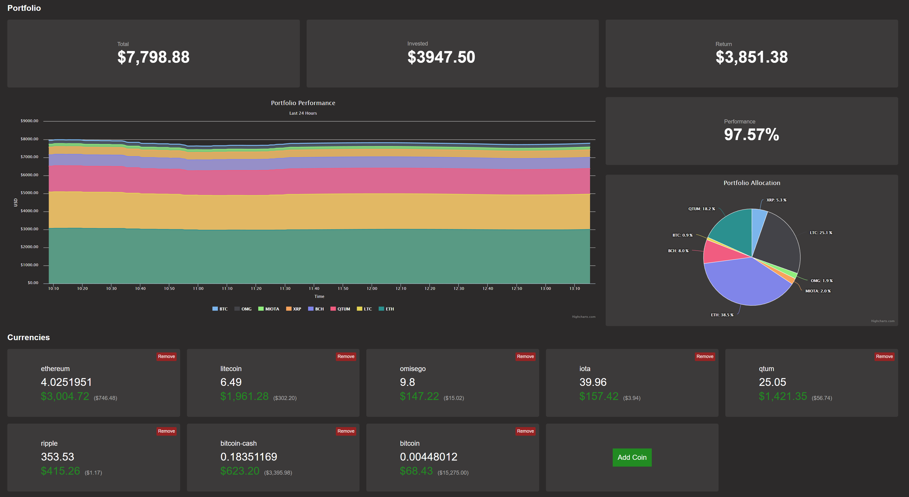

# Crypto Portfolio Dashboard

A convenient way to track your crypto asset performance in one place.



Just enter the amount of each coin you own, as well as the total amount of fiat you've invested into the markets.  The tool will automatically calculate your total effective return in realtime, as well as display information on your portfolio allocation and growth over time.

This utility uses http://coinmarketcap.com to acquire estimates on each coin's current market price.

## Get Started
```
# Install Meteor
$ curl https://install.meteor.com/ | sh

# Clone Repo
$ git clone https://github.com/msolters/crypto-portfolio-dashboard
$ cd crypto-portfolio-dashboard
$ meteor npm install

# Launch the app
$ meteor

# Now the app is serving at http://localhost:3000/
```

## Adding Coins
Simply click the "Add Coin" button.  A new coin box will appear.

The coin name *must* match the `id` field for the coin according to coinmarketcap's API, listed here: https://api.coinmarketcap.com/v1/ticker/

> Note: If you enter an invalid coin name (one that isn't recognized by coinmarketcap), portfolio data will not update until it is removed or fixed.

New coins will be reflected in the portfolio data within 15 minutes.

## Setting Investment Level
The "Invested" box is editable.  Here, you can enter the amount of fiat you've put into your portfolio total.  This is used to determine your portfolio's effective return and performance.
